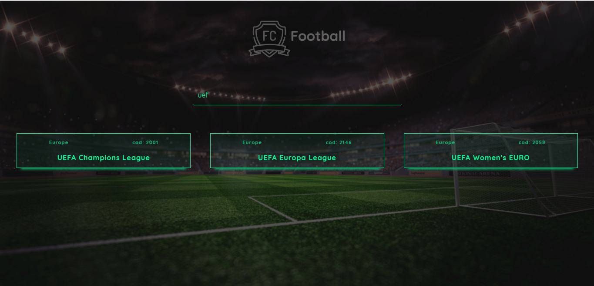
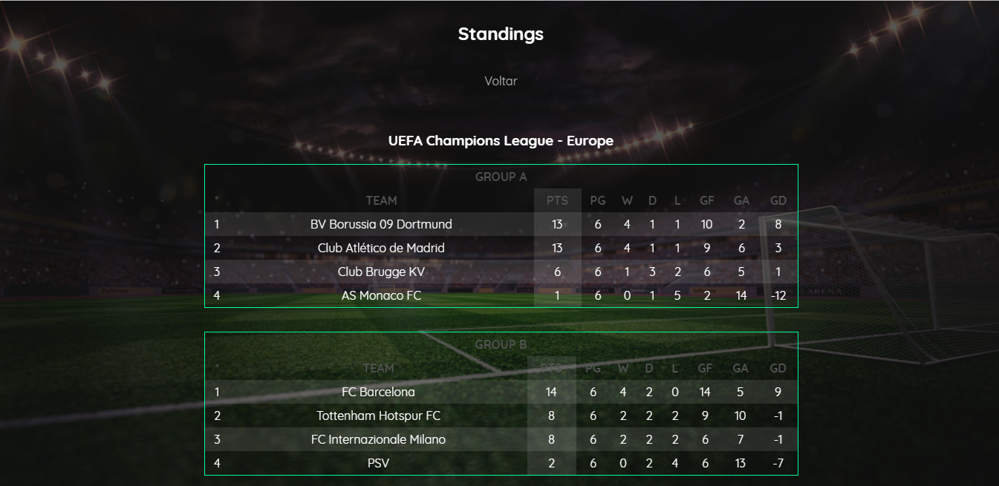
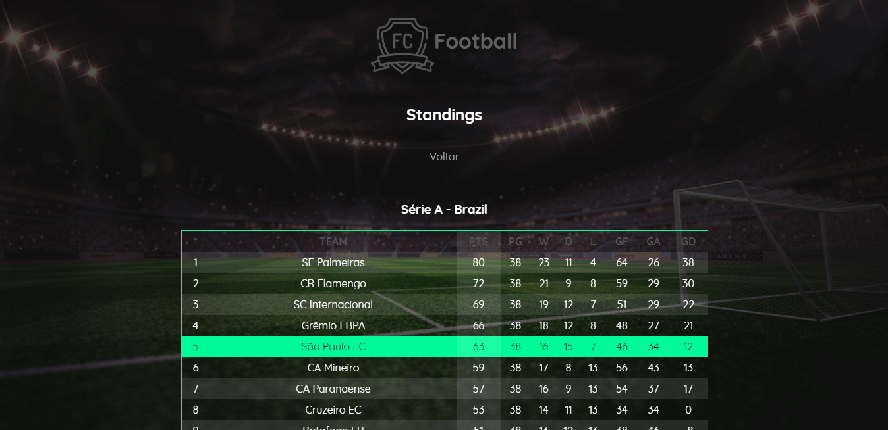

## ⚽ FoottBall App

Main: Search Competitions

Standings

Standings

API pública chamada football-data.org.

Single page application que aceite um código de competição (Ex: 2013 = Campeonato Brasileiro série A) e apresente uma lista com o ranking da mesma. A lista deve conter:

posição no ranking (atual ou final, caso o campeonato já tenha acabado)
- nome do time
- vitórias
- empates
- derrotas
- pontos

O plano FREE lista apenas o ranking de 12 campeonatos:

| ID   | Nome                  | País        |
| ---- | --------------------- | ----------- |
| 2000 | FIFA World Cup        | World       |
| 2001 | UEFA Champions League | Europe      |
| 2002 | Bundesliga            | Germany     |
| 2003 | Eredivisie            | Netherlands |
| 2013 | Série A               | Brazil      |
| 2014 | Primera Division      | Spain       |
| 2015 | Ligue 1               | France      |
| 2016 | Championship          | England     |
| 2017 | Primeira Liga         | Portugal    |
| 2018 | European Championship | Europe      |
| 2019 | Serie A               | Italy       |
| 2021 | Premier League        | England     |

`clone repo`

Instale as depenências
`yarn`

Run development
`yarn start`

Build
`yarn build`
